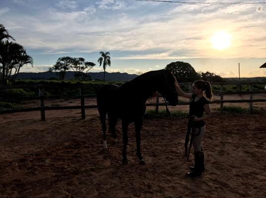

## About Me

### Lorena Dumba

---

# Introduction

- **Birthday**: February 7th
- **Hometown**: Belo Horizonte, Minas Gerais - Brazil
- **Program**: Plant Breeding and Genetics, Statistics
- **Expected Graduation**: August 2027

---

# My Favorite Animal

  
- *I love horses!*

---

# My Favorite Plot

```{r, echo=FALSE, fig.height=5, fig.width=7}

library(ggplot2)
library(readr)

# Corn Data 
corn_data <- read_table("corn_data.dat", 
                         col_names = TRUE, 
                         col_types = cols(
                           Year = col_double(),
                           Actual = col_double(),
                           Estimate = col_double()
                         ))

# Plot
ggplot(corn_data, aes(x = Year)) +
  geom_point(aes(y = Actual, color = "Actual"),) +
  geom_line(aes(y = Actual, color = "Actual"),) + 
  geom_point(aes(y = Estimate, color = "Estimate"), shape = 15,) +
  geom_line(aes(y = Estimate, color = "Estimate"),) +
  labs(
    title = "Corn Production: Actual vs. August Estimate",
    x = "Year",
    y = "Bushels/Acre"
  ) +
  scale_color_manual(name = "Legend", values = c("Actual" = "blue", "Estimate" = "orange")) +
  theme_minimal() +
  theme(legend.position = "bottom")


```

- *Reference:*https://www.nefb.org/08/23/2023/larger-crop-production-in-2023/

---

# CV Link Slide

[View PDF](CV.pdf)
---
